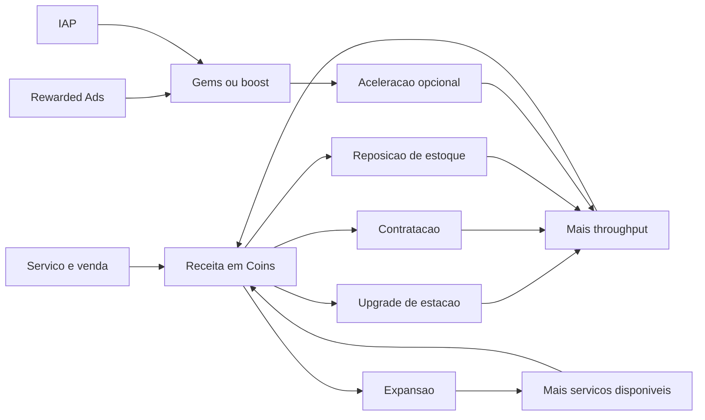

# Fluxo de Economia

## Objetivo
Representar como moedas entram, circulam e saem do sistema para sustentar progressão e monetização.

## Fluxograma Textual
```text
Servico concluido
  -> Pagamento em Coins
  -> Bonus opcionais (gorjeta, missao, rewarded ad)
  -> Saldo do jogador aumenta
  -> Jogador decide entre manter caixa ou investir
  -> Sinks: upgrades, contratacoes, expansoes, estoque
  -> Capacidade operacional cresce
  -> Novos servicos e volumes elevam receita futura

Fontes de Gems
  -> Login diario
  -> Conquistas
  -> Eventos
  -> Rewarded ads
  -> IAP
  -> Uso em aceleracoes e ofertas especiais
```

## Entradas
- Serviços pagos
- Missões
- Conquistas
- Eventos limitados
- Login diário
- Rewarded ads
- IAP

## Saidas
- Upgrades globais
- Upgrades por estação
- Contratação de funcionários
- Desbloqueio de expansões
- Reposição de estoque
- Aceleradores premium opcionais

## Eventos
- `RevenueGranted`
- `TipGranted`
- `CurrencySpent`
- `SinkCompleted`
- `PremiumCurrencyGranted`

## Dependencias
- [Economia](../GDD/Economia.md)
- [Progressao](../GDD/Progressao.md)
- [Monetizacao](../GDD/Monetizacao.md)

## Regras de Balanceamento
- A curva de custo deve crescer mais rápido que a receita por ação unitária, mas mais devagar que a receita por throughput.
- A progressão premium acelera o ritmo, mas não substitui o domínio do loop.# Fluxo de Economia

## Objetivo
Explicitar como a receita entra no sistema, como os custos saem e como a progressao economica se retroalimenta.

## Fluxo Textual
Servico concluido -> Cliente paga -> Coins entram -> Custos operacionais sao abatidos implicitamente no balance -> Jogador investe em upgrades, funcionarios e expansoes -> Throughput aumenta -> Receita por minuto cresce

## Mermaid



## Fontes de Receita
- Servicos de banho, tosa e secagem
- Venda de produtos
- Hotel para pets
- Clinica veterinaria
- Bonus de missao
- Recompensas de ads e eventos

## Saidas de Valor
- Upgrades de jogador e estacoes
- Contratacao e melhoria de funcionarios
- Desbloqueio de novas areas
- Estoque e manutencao operacional abstrata

## Dependencias
- [Economia](../GDD/Economia.md)
- [Upgrades](../GDD/Upgrades.md)
- [Expansao](../GDD/Expansao.md)
- [Monetizacao](../GDD/Monetizacao.md)