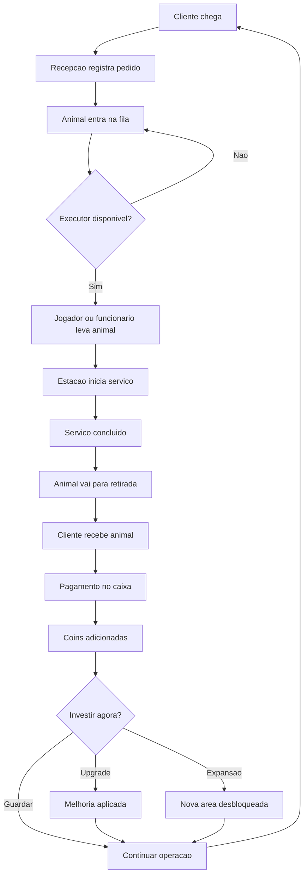

# Fluxo de Gameplay

## Objetivo
Representar o fluxo operacional central do jogo desde a chegada do cliente até reinvestimento em upgrades e expansões.

## Fluxograma Textual

```text
Inicio do turno
  -> Cliente chega
  -> Recepcao registra pedido
  -> Animal entra na fila de servico
  -> Scheduler busca executor disponivel
  -> Jogador ou funcionario transporta animal
  -> Estacao executa servico
  -> Animal vai para retirada
  -> Cliente recebe animal
  -> Caixa processa pagamento
  -> Economia atualiza saldo
  -> Jogador reinveste em upgrade, funcionario ou expansao
  -> Taxa operacional aumenta
  -> Novo cliente chega
```

## Estados Envolvidos
- Cliente: `Arriving`, `Queued`, `WaitingPickup`, `Paying`, `Leaving`
- Animal: `CheckedIn`, `Queued`, `InService`, `Ready`, `Delivered`
- Executor: `Idle`, `MoveToTask`, `ExecuteTask`, `Return`
- Estacao: `Locked`, `Available`, `Busy`, `Cleaning`

## Eventos
- `CustomerArrived`
- `PetCheckInCompleted`
- `TaskCreated`
- `TaskAssigned`
- `ServiceStarted`
- `ServiceCompleted`
- `CustomerPaid`
- `RevenueUpdated`
- `UpgradePurchased`

## Dependencias
- [Game Loop](../GDD/Game_Loop.md)
- [Gameplay](../GDD/Gameplay.md)
- [Economia](../GDD/Economia.md)

## Notas de Implementacao
- O loop deve ser fechado em menos de 90 segundos no início do jogo.
- Cada etapa precisa de feedback visual claro para reduzir ambiguidade operacional.# Fluxo de Gameplay

## Objetivo
Descrever o fluxo operacional do core loop desde a chegada do cliente ate a conversao em receita, upgrades e expansao.

## Fluxo Textual
Cliente chega -> Check-in na recepcao -> Animal entra em fila -> Recurso e alocado -> Servico executado -> Animal pronto -> Entrega ao cliente -> Pagamento no caixa -> Receita atualizada -> Compra de upgrade/expansao -> Novo ciclo

## Mermaid



## Estados Relevantes
- Cliente: `Arriving`, `Waiting`, `Paying`, `Leaving`
- Animal: `Queued`, `InTransit`, `InService`, `Ready`, `Delivered`
- Estacao: `Locked`, `Idle`, `Busy`, `Blocked`
- Funcionario: `Idle`, `MoveToTask`, `ExecuteTask`, `Return`, `Break`

## Eventos
- `CustomerArrived`
- `PetCheckedIn`
- `TaskAssigned`
- `ServiceStarted`
- `ServiceCompleted`
- `PaymentCompleted`
- `UpgradePurchased`
- `ExpansionUnlocked`

## Dependencias
- [Game Loop](../GDD/Game_Loop.md)
- [Funcionarios](../GDD/Funcionarios.md)
- [Estacoes](../GDD/Estacoes.md)
- [Economia](../GDD/Economia.md)