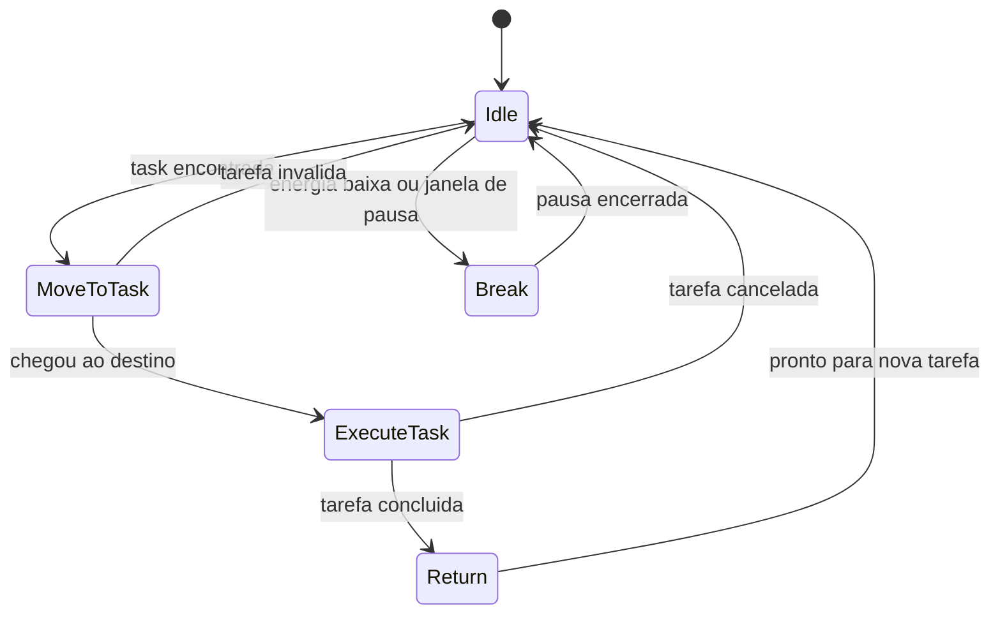

# Fluxo de IA

## Objetivo
Descrever o ciclo padrão da IA dos funcionários usando State Machine.

## Fluxograma Textual
```text
Idle
  -> verificar fila de tarefas
  -> se houver tarefa valida: MoveToTask
  -> ao chegar no alvo: ExecuteTask
  -> ao concluir: Return
  -> ao chegar ao ponto base: Idle
  -> se fadiga ou janela de pausa: Break
  -> ao terminar pausa: Idle
```

## Estados
- `Idle`: procura tarefa elegível.
- `MoveToTask`: navega até estação, item ou pet.
- `ExecuteTask`: realiza ação cronometrada.
- `Return`: volta ao ponto de origem ou próxima fila próxima.
- `Break`: pausa programada com redução de disponibilidade.

## Eventos
- `TaskAvailable`
- `TaskAccepted`
- `PathCompleted`
- `ExecutionStarted`
- `ExecutionFinished`
- `BreakStarted`
- `BreakEnded`
- `TaskCancelled`

## Dependencias
- [IA](../GDD/IA.md)
- [Funcionarios](../GDD/Funcionarios.md)
- [Estacoes](../GDD/Estacoes.md)

## Regras Operacionais
- O funcionário nunca assume duas tarefas simultâneas.
- Tarefas inválidas retornam o agente para `Idle`.
- Pausas não podem ocorrer durante uma tarefa não interrompível.# Fluxo de IA

## Objetivo
Mostrar a logica base de decisao e execucao dos funcionarios autonomos que sustentam o idle loop.

## Fluxo Textual
Funcionario ocioso -> Busca tarefa valida -> Move-se para a tarefa -> Executa acao -> Atualiza disponibilidade -> Retorna ao ponto de espera ou pega nova tarefa -> Entra em pausa se necessario

## Mermaid


## Regras de Prioridade
- Tarefas bloqueantes de fluxo principal tem prioridade maxima.
- Funcoes especializadas nao assumem tarefas fora do role salvo regras de gerente.
- Tarefas expiradas ou invalidadas retornam o agente para `Idle`.

## Dependencias
- [IA](../GDD/IA.md)
- [Funcionarios](../GDD/Funcionarios.md)
- [ADR-004 - IA](../ADR/ADR-004-IA.md)