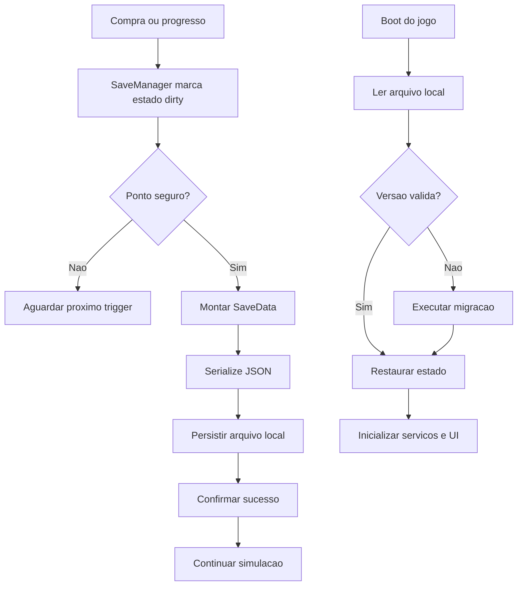

# Fluxo de Save

## Objetivo
Documentar quando e como o estado do jogo é persistido e recuperado.

## Fluxograma Textual
```text
Boot do jogo
  -> SaveManager procura slot local
  -> Se existir, carrega snapshot
  -> Valida versao e integridade
  -> Aplica migracao se necessario
  -> Restaura economia, upgrades, funcionarios e timestamp
  -> IdleService calcula receita offline
  -> Simulacao inicia

Durante o jogo
  -> Evento critico acontece
  -> Save dirty flag = true
  -> Autosave por intervalo ou checkpoint

Encerramento / pausa
  -> Save final
  -> Persistir timestamp
```

## Gatilhos de Save
- Compra de upgrade
- Contratação ou demissão sistêmica
- Expansão desbloqueada
- Missão concluída
- Mudança de saldo premium
- `OnApplicationPause`
- `OnApplicationQuit`

## Eventos
- `SaveLoadStarted`
- `SaveLoaded`
- `SaveMigrationApplied`
- `SaveRequested`
- `SaveCompleted`
- `SaveFailed`

## Dependencias
- [Save System](../GDD/Save_System.md)
- [Idle System](../GDD/Idle_System.md)
- [Arquitetura Unity](../GDD/Arquitetura.md)

## Notas de Implementacao
- Manter backup do último save íntegro.
- Não bloquear o frame crítico de gameplay com serialização pesada.# Fluxo de Save

## Objetivo
Documentar os gatilhos, o pipeline de serializacao e o caminho de restauracao de progresso.

## Fluxo Textual
Evento de progresso -> Sistema marca dirty state -> Autosave em ponto seguro -> Snapshot JSON gerado -> Arquivo local atualizado -> Na carga, snapshot e validado -> Migrações sao aplicadas -> Estado e restaurado na simulacao

## Mermaid


## Gatilhos de Save
- Compra de upgrade
- Desbloqueio de expansao
- Contratacao de funcionario
- Claim de missao ou recompensa
- Pause, focus lost ou encerramento seguro
- Autosave por intervalo controlado

## Dependencias
- [Save System](../GDD/Save_System.md)
- [ADR-002 - Save System](../ADR/ADR-002-SaveSystem.md)